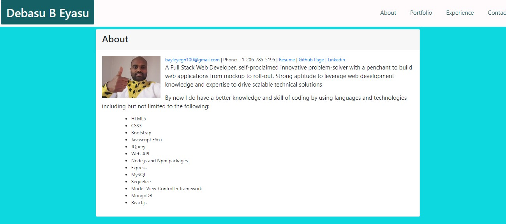

# My-Portfolio with React

## Table of Content
- [Description](#description)
- [Motivation](#motivation)
- [Guidelines](#guidelines)
- [Acknowledgement](#acknowledgement)
- [Question](#question)

## Description 

I developed a static personal website by using React.js. It has my portfolio, about me, Experiance and contact information. 
It will let my information to be avialabe online. 

## Motivation 

Now a days degitalization is step up dinamically. In this situation it is better to have a degitalized informaion to be eaily reachable by using the new technologies like React.js.

## Guidelines: 

Go ahead and see my website!

https://bayleyegn100.github.io/Portfolio/

https://github.com/bayleyegn100/Portfolio

## Acknowledgement

My instructor, my tutor, online information providers like google, you tube and others.  

## Question

If you have any questions you can reach me via [E-mail] (bayleyegn100@gmail.com). 

Here is a link to my Github profile: (http://github.com/bayleyegn100)

 

